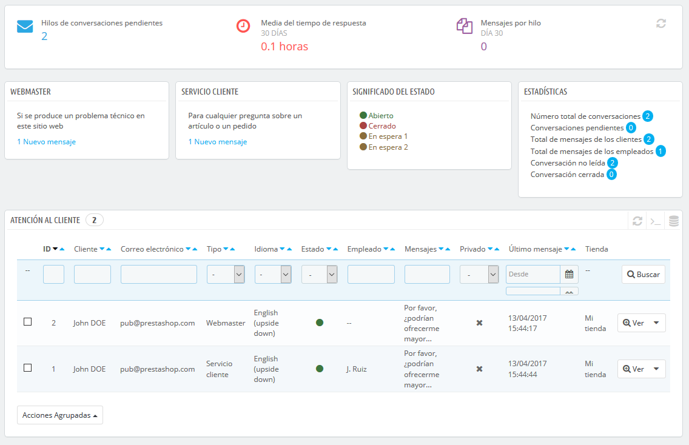
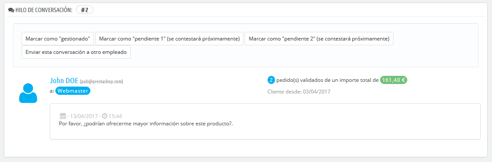
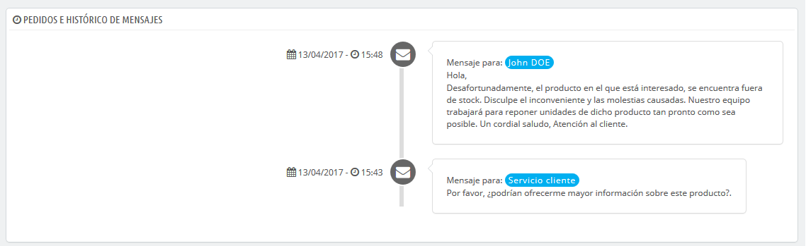
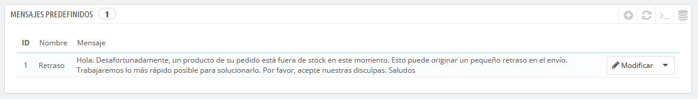
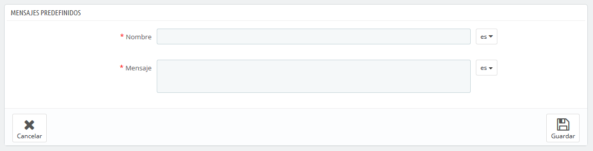
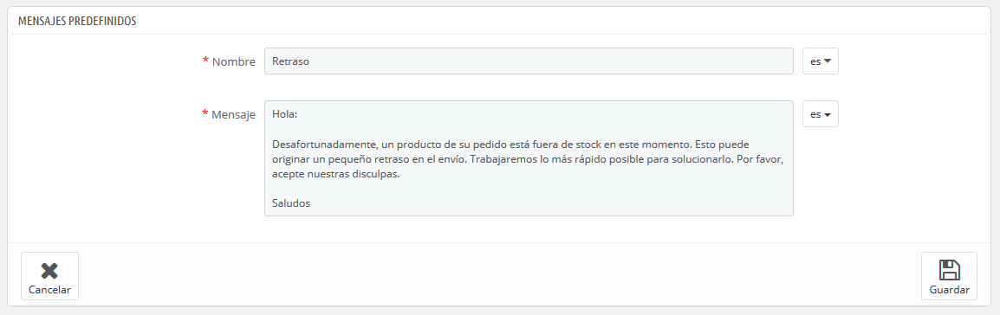
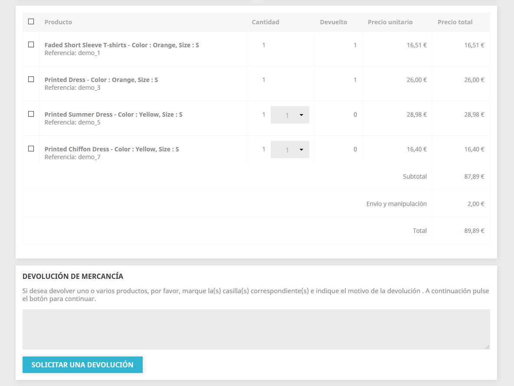
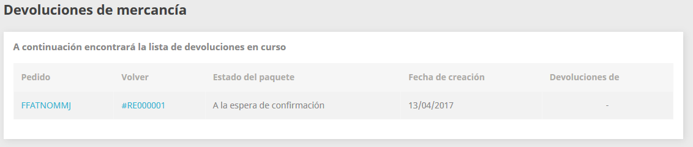
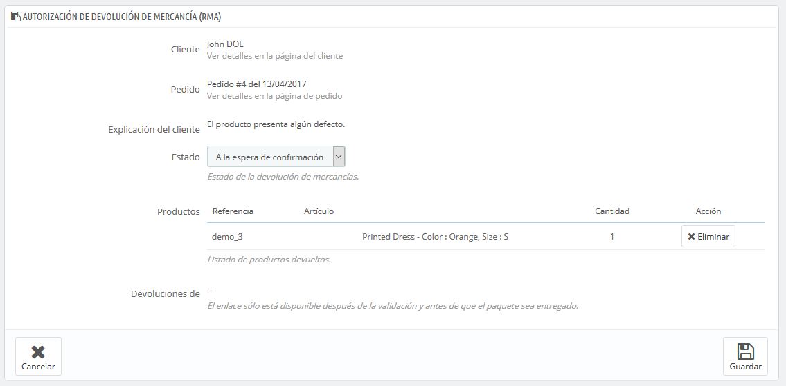

[⬅️ Volver](index.md#prestashop-doc) <!-- Enlace de regreso -->

---
# 🔔 Gestionar el Servicio de atención al cliente
---

PrestaShop te permite centralizar todas las solicitudes de los clientes, manteniendo un seguimiento organizado de las conversaciones sin depender de un cliente de correo externo como Outlook o Thunderbird.

## 📞 Servicio de Atención al Cliente
---

### ✉️ Introducción al Servicio de Atención al Cliente

??? info "Detalles generales"
    === "Descripción"
        El formulario de contacto de tu tienda, disponible en el enlace **Contáctenos** en el pie de página del front-office, ofrece contactos predeterminados como **Webmaster** y **Servicio de Atención al Cliente**. Los mensajes enviados a través de este formulario se almacenan en la herramienta de atención al cliente de PrestaShop, siempre que la opción **¿Guardar mensaje en Servicio al Cliente?** esté activada.

        > **Nota:** Si esta opción está desactivada, los mensajes solo se enviarán al correo electrónico del contacto y no se almacenarán en PrestaShop.

        Además, la correcta configuración de IMAP es crucial para recibir respuestas a los correos enviados desde la herramienta.

    === "Ventana del Servicio de Atención al Cliente"
        

---

### 🛠️ Gestionar los mensajes del Servicio de Atención al Cliente

??? info "Herramientas disponibles para gestionar mensajes"
    === "Descripción"
        Cada conversación con un cliente puede gestionarse completamente desde PrestaShop. Al abrir una conversación desde la lista de mensajes, puedes realizar las siguientes acciones:

        * **Cambiar estado del mensaje**:
            - **Marcar como gestionado** o **Reabrir**: Cambia entre los estados "Cerrado" y "Abierto".
            - **Pendiente 1** y **Pendiente 2**: Estados internos personalizables según las necesidades del equipo.
        * **Asignar discusión a otro empleado**: Reasigna la gestión del mensaje a otro miembro del equipo. Si el destinatario no está en la lista, puedes enviarlo a una dirección personalizada.
        * **Responder al siguiente mensaje sin respuesta en este hilo**: Acceso directo al próximo mensaje no respondido.

        > En el formulario de respuesta, puedes usar mensajes predefinidos para agilizar las respuestas.

    === "Ventana de gestión de mensajes"
        

    ??? question "**Nota:** En la parte inferior de la página, encontrarás una cronología de eventos relacionados con cada hilo de discusión, así como los pedidos y mensajes históricos del cliente."
        

---

### ⚙️ Opciones del Servicio de Atención al Cliente

??? info "Configuración del servidor de correo (IMAP)"
    === "Descripción"
        Para que la herramienta funcione correctamente, debes configurar el acceso IMAP en la sección **Opciones de servicio al cliente**. Los campos principales incluyen:

        * **Enlace IMAP, Puerto IMAP, Usuario IMAP, Contraseña IMAP**: Credenciales esenciales proporcionadas por tu proveedor de hosting.
        * **Eliminar mensajes**: Borra mensajes del servidor una vez recibidos en PrestaShop. Usa con precaución.
        * **Crear nuevos hilos**: Genera nuevos hilos para correos no reconocidos.
        * Opciones avanzadas como:
            - **/pop3**: Cambia a POP3 en lugar de IMAP.
            - **/ssl** y **/tls**: Configuran cifrado para conexiones seguras.
            - **/novalidate-cert** y **/notls**: Opciones para desactivar validaciones de seguridad (no recomendado).

        Ajusta estas opciones según las capacidades de tu servidor de correo.

    === "Configuración IMAP"
        

## 💬 Mensajes predefinidos
---

### 📩 Herramienta para gestionar comunicaciones: Mensajes predefinidos

??? info "Descripción general de mensajes predefinidos"
    === "Descripción"
        Los mensajes predefinidos en PrestaShop son una herramienta útil para gestionar las comunicaciones con tus clientes. Permiten reutilizar mensajes frecuentes, ahorrando tiempo y asegurando consistencia en tus respuestas.

        Puedes guardar y reutilizar mensajes comunes desde la página **Mensajes predefinidos** bajo el menú **Servicio al cliente**. Al instalar PrestaShop, un mensaje predefinido ("Retraso") ya está registrado como ejemplo.

    === "Ventana de Mensajes predefinidos"
        

### ✍️ Crear un nuevo mensaje predefinido

??? info "Pasos para crear un mensaje predefinido"
    === "Descripción"
        1. Ve a la página **Mensajes predefinidos** en el menú **Servicio al cliente**.
        2. Haz clic en el botón **Añadir un nuevo mensaje predefinido**.
        3. Completa el formulario:
            - **Nombre**: Asigna un nombre descriptivo para identificar fácilmente el mensaje.
            - **Mensaje**: Escribe el contenido del mensaje que deseas enviar a tus clientes.
        4. Haz clic en **Guardar**.

        Puedes editar mensajes existentes o crear tantos nuevos como necesites.

    === "Ventana de Crear mensaje"
        

### 📤 Enviar un mensaje predefinido a un cliente

??? info "Cómo enviar un mensaje predefinido"
    === "Descripción"
        Una vez que hayas creado tus mensajes predefinidos, puedes utilizarlos en los pedidos de los clientes:

        1. Selecciona el mensaje predefinido en la página del pedido.
        2. Personaliza el contenido según el cliente o pedido, si es necesario.
        3. Activa la opción **¿Mostrar al cliente?** para que el cliente lo reciba.
        4. Haz clic en **Enviar mensaje**.

        El mensaje será enviado a la dirección de correo electrónico asociada al cliente. Puedes realizar un seguimiento de la conversación desde la página **Servicio al cliente**, en el menú **Clientes**.

    === "Ventana de Enviar mensaje predefinido"
        

## ♻️ Devoluciones de mercancía
---

### 🔄 Descripción general de devoluciones

??? info "Descripción general de devoluciones"
    === "Descripción"
        Las devoluciones de mercancía son un aspecto esencial del servicio al cliente en cualquier tienda en línea. PrestaShop permite gestionar devoluciones a través de la funcionalidad RMA (Return Merchandise Authorization), ofreciendo tanto al cliente como al administrador de la tienda un proceso estructurado y eficiente.

        La página **Devoluciones de mercancía** en PrestaShop ofrece acceso a una lista de todos los procesos de devolución en curso. Puedes activar esta funcionalidad desde el back-office, permitiendo a tus clientes solicitar devoluciones dentro de un período específico después de la compra. Además, puedes configurar los estados de los pedidos que habilitan esta opción.

    === "Ventana de Devoluciones de mercancía"
        

### 💼 Proceso de devolución: Desde el punto de vista del cliente

??? info "Cómo realizar una devolución"
    === "Descripción"
        Cuando la opción RMA está habilitada, los clientes pueden realizar devoluciones de productos directamente desde su cuenta. Para ello, deben:

        1. Acceder a la sección **Historial de pedidos** desde su cuenta.
        2. Seleccionar el pedido del que desean devolver un producto y hacer clic en **Detalles**.
        3. Marcar los productos que desean devolver utilizando las casillas de verificación junto a sus nombres.
        4. Especificar la cantidad que desean devolver, si es necesario.
        5. Opcionalmente, añadir una explicación para detallar la razón de la devolución.
        6. Hacer clic en **Solicitar una devolución**.

        Una vez completado, el estado del pedido cambiará a **A la espera de confirmación**, y aparecerá en la página **Devoluciones de mercancía**.

    === "Ventana de proceso de devolución"
        

??? info "Condiciones para realizar devoluciones"
    === "Descripción"
        Las devoluciones están sujetas a las siguientes condiciones:

        1. **Activar devoluciones**: La funcionalidad RMA debe estar habilitada desde el back-office.
        2. **Período de validez**: El pedido debe encontrarse dentro del período de devolución configurado.
        3. **Estados de pedido**: El pedido debe tener al menos:
            - Dos estados: uno configurado como "Pagado" y otro como "Enviado".
            - O un estado con ambas condiciones activadas ("Pagado" y "Enviado").

        Puedes configurar los estados de los pedidos desde la sección **Configuración de pedidos** en el menú **Parámetros de la tienda**.

    === "Ventana de estados configurables para devoluciones"
        

### 📦 Proceso de devolución: desde el punto de vista del comerciante

??? info "Detalles del proceso de devolución"
    El proceso de devolución desde el back-office de tu tienda es fundamental para gestionar solicitudes de clientes de manera organizada y eficiente. Las devoluciones pasan por diferentes estados para garantizar que se sigan los pasos adecuados.

    === "Descripción"
        La solicitud de devolución aparece en la página **Devoluciones de mercancías** del back-office. Inicialmente, el estado es **"A la espera de confirmación"**. Desde allí, puedes gestionar la devolución siguiendo un flujo estructurado que incluye varios estados, como:

        * **A la espera de confirmación.**
        * **A la espera del paquete.**
        * **Paquete recibido.**
        * **Devolución denegada.**
        * **Devolución completada.**

        Estos estados te permiten supervisar el progreso de cada solicitud de devolución.

    === "Ventana del proceso de devolución"
        

    === "Ventana de autorización de devolución de mercancía (RMA)"
        

### 💸 Reembolsado del importe del pedido al cliente

??? info "Detalles sobre reembolsos"
    El reembolso de un pedido, parcial o completo, es una acción necesaria en muchos casos de devolución. Este proceso puede gestionarse directamente desde la página del pedido.

    === "Descripción"
        En la página de pedidos, puedes encontrar botones específicos para gestionar reembolsos y devoluciones:

          * **Devolver productos**: Para registrar productos devueltos y ajustar el inventario.
          * **Reembolso parcial**: Para reembolsar parcialmente el importe del pedido, dependiendo de las circunstancias.

        Además, puedes seleccionar opciones adicionales, como:

          * **Reingresar productos al inventario.**
          * **Generar una factura por abono.**
          * **Generar un bono de descuento.**
          * **Reembolsar gastos de envío.**

    === "Ventana de opciones de reembolso"
        