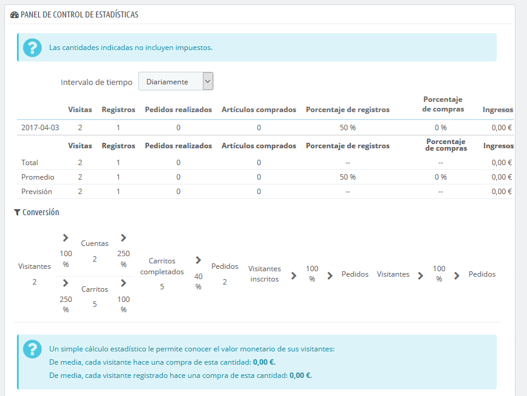
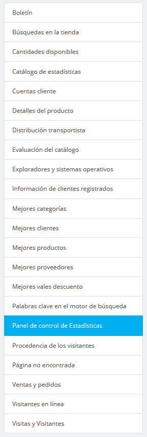

[⬅️ Volver](index.md#prestashop-doc) <!-- Enlace de regreso -->

# 📈 Comprender las estadísticas
---

## 📊 Visión general de las estadísticas

??? info "Descripción general de las estadísticas"
    Las estadísticas son una herramienta esencial para analizar y optimizar el rendimiento de tu tienda en PrestaShop. La sección "Estadísticas" ofrece una visión integral de los datos clave de tu tienda, permitiéndote tomar decisiones informadas para mejorar la experiencia del cliente y aumentar las ventas.

    === "Descripción"
        La página de estadísticas muestra una variedad de informes útiles sobre el rendimiento de tu tienda. Puedes filtrar los datos por períodos específicos y analizar categorías clave como ventas, métodos de pago, idiomas, transportistas, y más.

    === "Ventana principal de estadísticas"
        

## 🖥️ Interfaz principal

??? info "Explora el cuadro de mando principal"
    === "Descripción"
        En la parte superior de la página, puedes seleccionar un período de tiempo para mostrar los datos estadísticos. Los intervalos disponibles son:
        
        - Día, mes o año actual.
        - Día, mes o año anterior.
        - Período personalizado.

        El cuadro de mando contiene 8 secciones clave:

        1. **Principales estadísticas**: Una tabla con métricas importantes como visitantes, pedidos, y volumen de ventas.
        2. **Conversión**: Analiza el valor de tu tienda basado en carritos completados.
        3. **Distribución por métodos de pago**: Identifica los métodos de pago más populares entre tus clientes.
        4. **Distribución por categorías**: Descubre qué categorías generan más ventas o visitas.
        5. **Distribución por idiomas**: Verifica los idiomas más utilizados por tus clientes.
        6. **Distribución por zonas**: Analiza clientes y ventas según su ubicación geográfica.
        7. **Distribución por monedas**: Evalúa el uso de diferentes monedas en los pedidos.
        8. **Distribución por atributos**: Entiende qué atributos son más populares en tus productos.

    === "Vista del cuadro de mando"
        

## 📉 Navegando por las estadísticas

??? info "Explora las herramientas de análisis"
    === "Descripción"
        PrestaShop ofrece múltiples secciones estadísticas para optimizar tu tienda. Entre ellas:

        - **Mejores categorías**: Analiza las categorías más exitosas por ventas y visitas.
        - **Mejores clientes**: Identifica a tus clientes más leales y valiosos.
        - **Mejores proveedores**: Evalúa la efectividad de tus proveedores.
        - **Mejores cupones de descuento**: Analiza el impacto de tus promociones.
        - **Mejores productos**: Descubre qué productos destacan en tu catálogo.
        - **Distribución por transportista**: Identifica los transportistas más utilizados.

    === "Vista de navegación por estadísticas"
        

## 💡 Consejos prácticos

??? tip "Cómo aprovechar al máximo las estadísticas"
    - **Filtrar datos por períodos**: Utiliza los filtros de tiempo para analizar el rendimiento en campañas específicas.
    - **Exportar a CSV**: Descarga los datos para realizar análisis adicionales con herramientas externas.
    - **Monitorea visitantes en tiempo real**: Identifica patrones de comportamiento para optimizar la experiencia del usuario.
    - **Mejora los productos con baja conversión**: Actúa sobre los productos menos populares para potenciar su rendimiento.

---

Con estas estadísticas detalladas, puedes tomar decisiones basadas en datos reales para optimizar la experiencia de tus clientes y aumentar las ventas en tu tienda PrestaShop.
