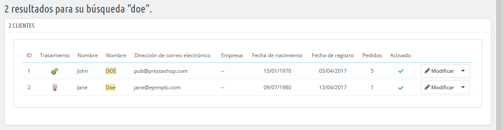
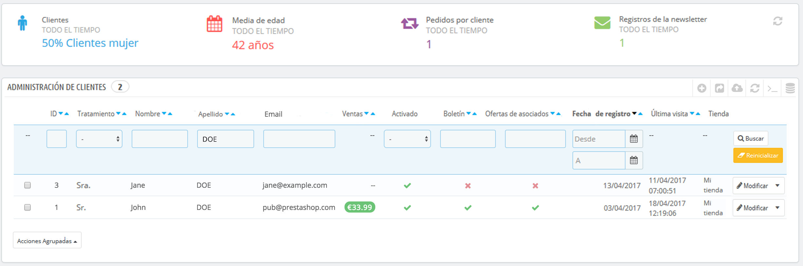
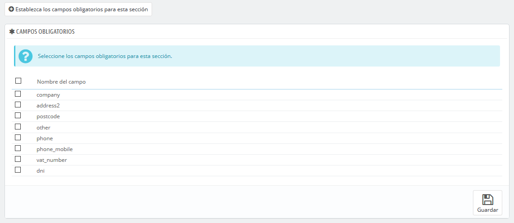
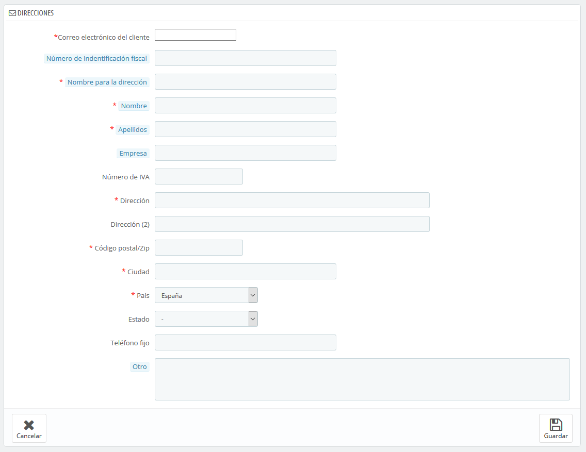
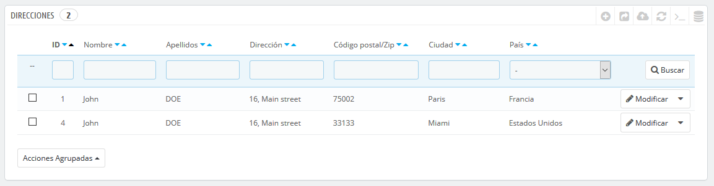
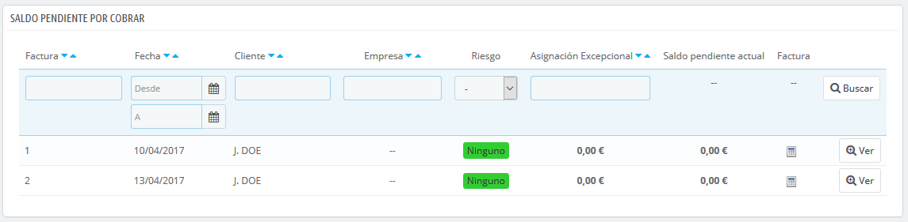

[⬅️ Volver](index.md#prestashop-doc) <!-- Enlace de regreso -->

---
# 👥 Gestionar Clientes
---

## 📋 Tus clientes
---

??? info "La página inicial bajo el menú **Clientes** ofrece una visión general de todos los usuarios registrados en tu tienda."
    === "Descripción"
        ??? question "Esta vista proporciona información clave para gestionar y ordenar las cuentas de clientes según las necesidades de administración."

            * **ID**: Identificación única del cliente.
            * **Tratamiento**: Título social del cliente, que ayuda a personalizar la experiencia. Puedes gestionar estos títulos en **Parámetros de la tienda > Ajustes sobre clientes > Tratamientos**.
            * **Nombre y Apellido**: Identificación del cliente.
            * **Correo electrónico**: Dirección usada para registrarse.
            * **Ventas**: Monto total gastado por el cliente en la tienda.
            * **Estado**: Indica si la cuenta está activa; se puede activar o desactivar.
            * **Boletín**: Muestra si el cliente está suscrito a la newsletter.
            * **Ofertas de Socios**: Indica si el cliente aceptó recibir correos de socios, con consentimiento.
            * **Fechas de Registro y Última Visita**: Ayudan a analizar la actividad del cliente.
            * **Acciones**: Opciones para editar, ver detalles o eliminar la cuenta del cliente.

        ??? question "Usuario de ejemplo en PrestaShop"

            Cuando se instala PrestaShop con datos de muestra, se incluye un usuario predeterminado, **John DOE**. Esta cuenta de prueba permite simular la experiencia del cliente en tu tienda. 
            > **Importante**: Antes de abrir la tienda, elimina o modifica esta cuenta para evitar usos malintencionados.

            **Credenciales de prueba**:
            * **Email**: pub@prestashop.com
            * **Contraseña**: 123456789

            Puedes exportar la lista de clientes en formato CSV usando el botón **Exportar**, o importar clientes con un archivo CSV que siga el formato adecuado desde **Parámetros Avanzados > Importación**.

    === "Vista de listado de clientes"
        

### ✍️ Crear una nueva cuenta de cliente
---

??? info "Crear manualmente una cuenta de cliente"
    === "Descripción"
        Para crear una cuenta de cliente manualmente, haz clic en **Añadir cliente**. Completa el formulario que se muestra con la siguiente información clave:

        * **Tratamiento**: Selecciona un título social disponible o crea uno nuevo desde **Parámetros de la tienda > Ajustes sobre clientes > Títulos**.
        * **Nombre, Apellidos y Correo Electrónico**: Datos esenciales para el acceso y comunicaciones.
        * **Contraseña**: Debe tener al menos 5 caracteres.
        * **Fecha de Nacimiento**: Opcional para promociones personalizadas. Este campo puede desactivarse en **Ajustes sobre clientes**.
        * **Activado**: Define si la cuenta estará activa.
        * **Ofertas de Socios**: Permite la suscripción a correos de socios con consentimiento del cliente.
        * **Acceso de Grupo**: Permite aplicar descuentos y beneficios específicos por grupos.
        * **Grupo Predeterminado**: Aunque un cliente puede pertenecer a varios grupos, siempre debe tener uno principal.

        > **Modo B2B**: Activa el modo B2B en **Parámetros de la tienda > Ajustes sobre clientes** para añadir campos específicos para empresas (Empresa, SIRET, APE, Sitio Web, etc.) que ayudan a gestionar cuentas corporativas y saldos pendientes.

    === "Formulario para nueva cuenta de cliente"
        

### 👁️ Visualizar la información de un cliente
---

??? info "Para obtener detalles adicionales sobre un cliente, haz clic en **Ver** en la lista de clientes. Esto abre una vista detallada con secciones específicas:"
    === "Descripción"
        #### 📊  Datos detallados disponibles en la vista de cliente
        * **Información del Cliente**: Datos personales y de cuenta, como nombre, correo, tratamiento, fecha de registro, última visita e índice de riesgo.
        * **Suscripciones**: Estado de suscripción al boletín y a las ofertas de socios.
        * **Notas Privadas**: Comentarios internos del equipo sobre el cliente.
        * **Mensajes**: Historial de mensajes entre el cliente y el equipo de atención.
        * **Cupones**: Descuentos o reglas de carrito aplicadas al cliente.
        * **Últimas Conexiones**: Historial de accesos a la tienda.
        * **Grupos**: Grupos a los que pertenece el cliente.
        * **Pedidos**: Historial de compras, incluyendo montos, métodos de pago y estados.
        * **Carritos**: Carritos creados (incluso los no validados).
        * **Productos Comprados**: Lista de productos comprados, con acceso a los detalles de cada pedido.
        * **Productos Más Vistos**: Muestra los productos que más ha visitado el cliente, lo que ayuda a ofrecer promociones dirigidas.

    === "Vista detallada de información del cliente"
        

### 🔎 Búsqueda de clientes

??? info "PrestaShop permite buscar clientes de dos maneras para facilitar la gestión y el análisis."

    #### Método 1: Búsqueda en la barra superior
    ??? question "Usa la barra de búsqueda en el back-office para buscar clientes por ID, nombre, correo electrónico o dirección IP."
        === "Descripción"
            1. Introduce los datos del cliente en la barra de búsqueda en la parte superior del back-office.
            2. Selecciona el criterio de búsqueda entre **Todo**, **Por nombre** o **Por dirección IP**.
            3. Los resultados mostrarán la ID, tratamiento, correo electrónico, fecha de nacimiento, fecha de registro, cantidad de pedidos y estado de cuenta del cliente.

        === "Barra de búsqueda de PrestaShop"
            
        
        === "Resultados de búsqueda en barra superior"
            

    #### Método 2: Filtros en la lista de clientes
    ??? question "Filtra la lista de clientes en la página Clientes usando varios criterios, como ID, nombre, email, estado, suscripciones y fechas."
        === "Descripción"
            1. Accede a la página **Clientes** y utiliza los campos de la parte superior para aplicar filtros.
            2. Puedes filtrar según **ID**, **Tratamiento**, **Nombre**, **Email**, **Estado**, **Boletín**, **Ofertas de Socios**, **Fecha de Registro** y **Última Conexión**.
            3. Haz clic en **Filtrar** para aplicar los criterios seleccionados y visualizar solo los clientes que cumplen con esos parámetros.

        === "Vista de filtros en la lista de clientes"
            

## 🏠 Direcciones de clientes
---

??? info "Direcciones de clientes"
    === "Descripción"
        ### 📒 Página **"Direcciones"**

        Al acceder a la página **"Direcciones"** en el menú de clientes, verás una lista de todas las direcciones registradas de tus clientes, como las de su hogar o lugar de trabajo. Desde aquí, puedes **modificar** o **eliminar** direcciones de manera definitiva.

        ??? question "Configura los campos obligatorios de las direcciones"
            === "Descripción"
                Debajo de la tabla de direcciones, encontrarás el botón **"Establece los campos obligatorios para esta sección"**. Este botón abre un formulario que permite marcar campos específicos de la base de datos como obligatorios o no. Por ejemplo, puedes configurar los campos **"Empresa"** o **"Teléfono"** como obligatorios para los clientes que registren una nueva dirección en la tienda.

            === "Formulario de los campos obligatorios de direcciones"
                

        ### ➕ Añadir una nueva dirección

        ??? question "Campos clave para la creación de direcciones"
            === "Descripción"
                Al añadir una nueva dirección, presta especial atención a estos campos:

                * **Correo electrónico del cliente**: Esencial para identificar al cliente. Asegúrate de ingresar el correo del cliente existente para que PrestaShop asocie correctamente esta nueva dirección.
                * **Número de identificación fiscal**: Documento de identidad o número de identificación fiscal, este campo es opcional.
                * **Alias de dirección**: Una descripción breve para identificar la dirección fácilmente, como "Casa", "Oficina", etc.
                * **Empresa**: El nombre de la empresa del cliente si es necesario.
                * **Número de IVA**: El número de identificación del IVA de la empresa o cliente.
                * **Otro**: Campo para información adicional útil para el envío.

            === "Formulario para agregar una nueva dirección"
                

        Puedes crear manualmente una nueva dirección para un cliente utilizando el botón **"Añadir nueva dirección"**. Al hacer clic, se abrirá un formulario en pantalla.

    === "Vista de Direcciones de clientes"
        

## 💼 B2B - Saldo pendiente por cobrar
---

??? info "Saldo pendiente por cobrar"

    Esta página solo está disponible cuando se habilita la funcionalidad B2B. Para activarla, dirígete a **Ajustes sobre clientes** en el menú **Parámetros de la tienda** y selecciona **Sí** en la opción **Activar modo B2B**.

    Cuando el modo B2B está activado, esta página muestra el saldo pendiente actual para algunos de tus clientes, es decir, la cantidad de crédito que les permites utilizar para comprar productos antes de que deban realizar el pago.

    ### 🔓 Activar la funcionalidad de Saldo pendiente por cobrar
    ---

    Cuando el modo B2B está habilitado (**Parámetros de la tienda > Ajustes sobre clientes**), se añaden tres campos adicionales al formulario de creación de cliente:

    ??? question "Configura el crédito y riesgo para tus clientes B2B"
        === "Descripción"
            * **Cantidad máxima pendiente permitida**: Monto máximo de crédito autorizado para la empresa.
            * **Número máximo de días para pagar**: Plazo permitido para que la empresa realice el pago de los productos.
            * **Índice de riesgo**: Calificación de riesgo asignada a la empresa: Ninguna, Baja, Media o Alta. Esta calificación te ayuda a evaluar si el cliente es confiable en sus pagos.

        === "Ventana de configuración B2B"
            

    Completa estos campos para todos tus clientes profesionales para gestionar de manera efectiva el saldo pendiente y el riesgo.

    ### 📊 Pantalla de saldos pendientes por cobrar
    ---

    Una vez que un cliente tiene saldo positivo para realizar compras en tu tienda, este saldo aparece en la página **Clientes > Saldos pendientes por cobrar**. Esta vista ofrece un resumen general de las facturas pendientes y permite gestionar fácilmente los créditos autorizados a cada cliente B2B.

    ??? question "Revisión de facturas y saldos pendientes"
        === "Descripción"
            Esta pantalla proporciona una lista clara de las cuentas con saldo pendiente de pago, con información relevante para cada cliente, como el límite de crédito, los días restantes para el pago y el índice de riesgo.

        === "Pantalla de saldos pendientes"
            
