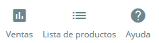
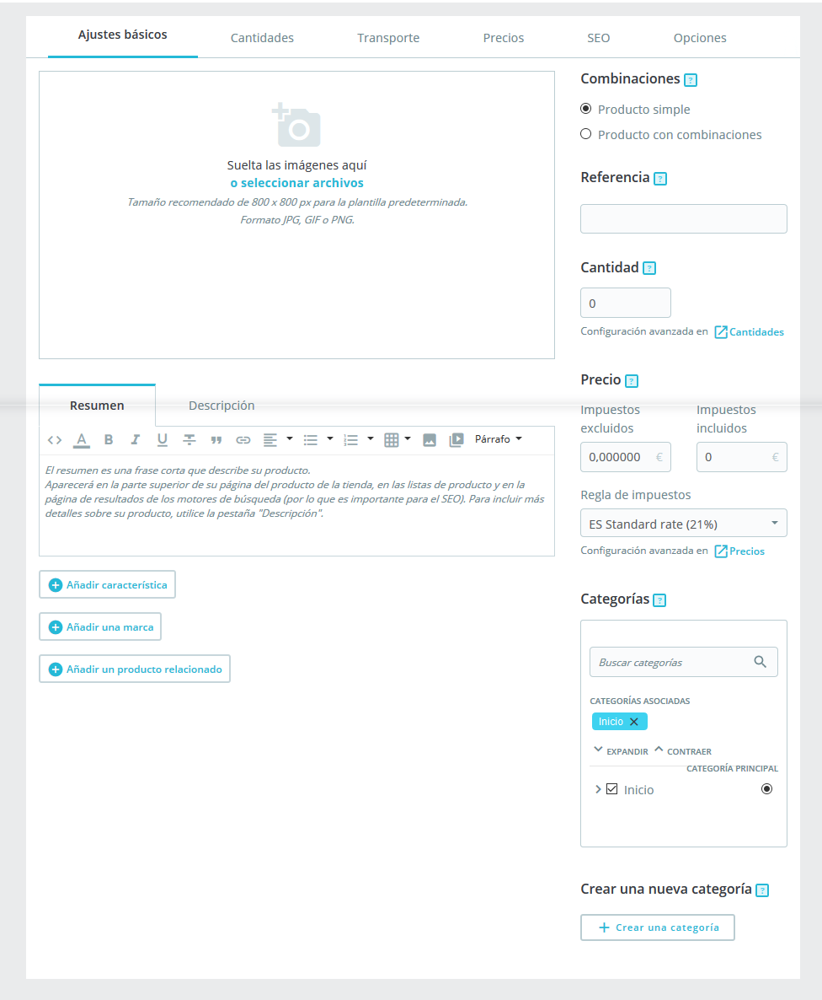
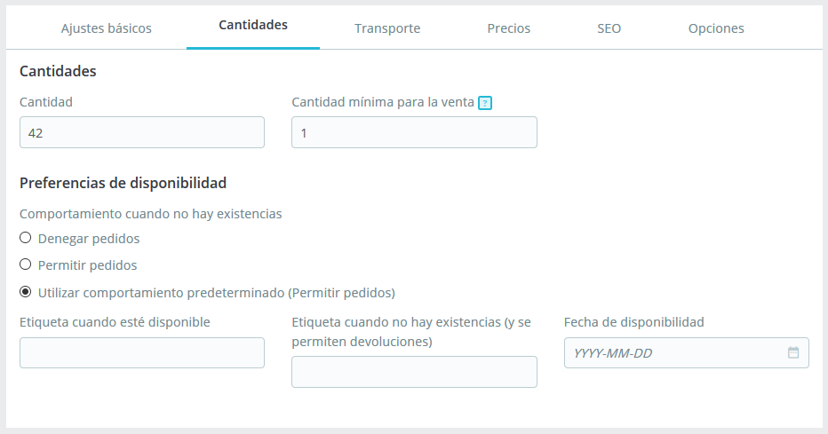
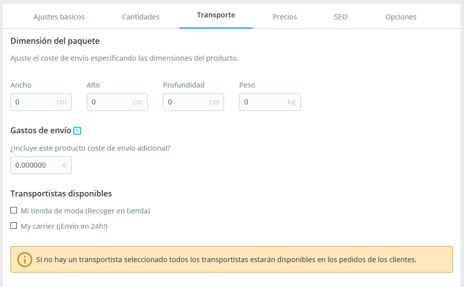
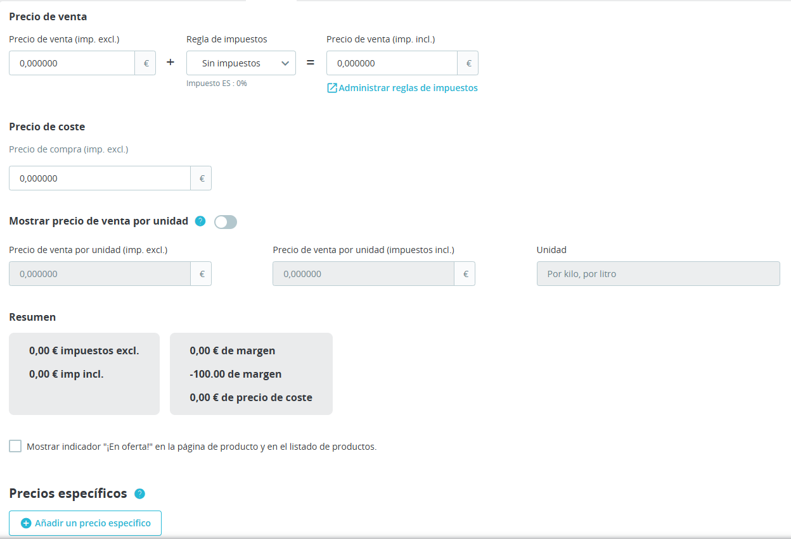
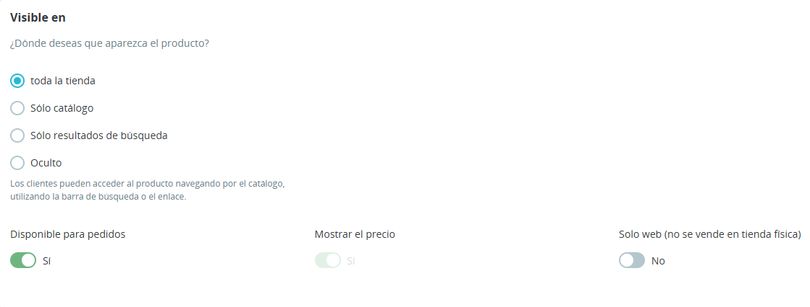
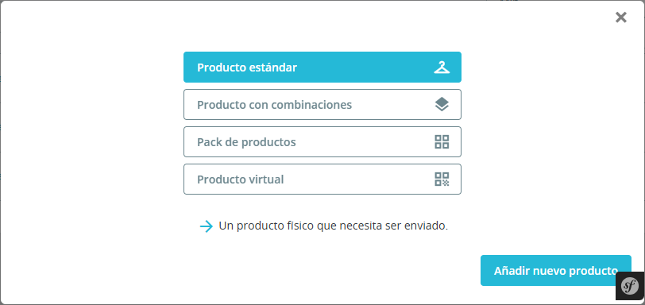

[⬅️ Volver](index.md#prestashop-doc) <!-- Enlace de regreso -->

# Gestionar los productos 🛍️
---

La sección "Productos", ubicada bajo el menú **Catálogo**, te permite gestionar de forma completa todos los productos de tu tienda en PrestaShop.

## 📝 Introducción a la página de producto

---

Para crear un nuevo producto, ve a la página **Catálogo** y haz clic en **Nuevo producto** o utiliza el atajo de teclado `CTRL + P`. Esto abrirá la **página de producto**, donde puedes crear nuevos productos o editar los existentes.

??? question "🔍 Pestañas de la página de producto en PrestaShop 8.2.0"

    La página de producto está dividida en varias pestañas:

    * **Ajustes básicos**: Para crear un producto de manera rápida y fácil. Si necesitas más detalles, revisa las otras pestañas.
    * **Cantidades / Combinaciones / Producto virtual**: Para gestionar el stock. La pestaña se adapta al tipo de producto (combinaciones o virtuales).
    * **Transporte**: Información sobre el peso, tamaño, y otros detalles que afectan el envío.
    * **Precios**: Define precios específicos o el precio por unidad.
    * **SEO**: Configura la meta descripción y la URL optimizada para SEO.
    * **Opciones**: Administra la visibilidad del producto, sus referencias, archivos adjuntos, proveedores, y personalización.

### 📛 Nombre del producto

El primer campo es el **nombre del producto**, que aparece en los motores de búsqueda y la URL del producto. Selecciona el idioma en el que deseas editar el producto a través del **selector de idioma** junto al campo.

**Nota**: El nombre debe asignarse al menos en el idioma predeterminado de la tienda para guardar el producto.

### 🎁 Tipo de producto

Especifica el tipo de producto:

* **Producto clásico**: Se envía físicamente.
* **Pack o paquete de productos**: Combinación de al menos dos productos existentes.
* **Producto virtual**: Archivo descargable o servicio.

> Esta guía aborda el tipo "Producto clásico". Los productos en pack y los virtuales se detallan en secciones específicas.

### 🌐 Idioma

Si tienes varios idiomas habilitados en tu tienda, puedes traducir las descripciones, títulos y otros contenidos del producto. Cambia el idioma desde el **selector de idioma** junto al campo del tipo de producto. La página del producto se actualizará en el idioma seleccionado.

> **Tip**: Para añadir nuevos idiomas a tu tienda, ve a **Internacional > Traducciones**.

### 🚀 Botones globales y acciones rápidas

* **Ventas**: Muestra estadísticas de visitas y ventas del producto.
* **Lista de productos**: Acceso rápido a todos los productos de la tienda.
* **Ayuda**: Acceso a la ayuda contextual.

En la parte inferior de la página, se encuentran estas acciones rápidas:

* **Eliminar**: Borra el producto actual y toda su información asociada.
* **Vista previa**: Muestra cómo verá el cliente el producto en el front-office.
* **En línea / Fuera de línea**: Activa o desactiva el producto en la tienda.
* **Duplicar**: Crea una copia del producto actual. Ideal para usar como plantilla de otros productos similares.
  > ⚠️ Si necesitas versiones del producto en diferentes colores o tamaños, usa **combinaciones** en lugar de duplicar.

* **Ir al Catálogo**: Guarda cambios y regresa al listado de productos.
* **Añadir nuevo producto**: Guarda cambios y abre una página para crear un nuevo producto.
* **Guardar**: Guarda los cambios sin salir de la página actual, ideal para cambiar entre pestañas sin perder datos.

---

>### ⌨️ Atajos de teclado
>
>PrestaShop 8.2.0 ofrece atajos para facilitar la creación y edición de productos:
>
> * **Ir al Catálogo**: `CTRL + Q`
> * **Guardar**: `CTRL + S`
> * **Añadir nuevo producto**: `CTRL + P`
> * **Duplicar**: `CTRL + D`
>
---

## ✏️ Crear un producto
---

La página de producto en PrestaShop 8.2.0 ha sido rediseñada para facilitar la creación de productos mediante el uso de varias pestañas.

### ⚙️ Ajustes básicos

??? info "Detalles adicionales"
    === "Descripción"
        La pestaña "Ajustes básicos" contiene las opciones esenciales para crear rápidamente un producto en unos pocos clics. Desde aquí puedes navegar a otras pestañas para añadir detalles adicionales.

    === "Ventana de Ajustes Básicos"
        
---

#### 📷 Imágenes

??? question "<b>Sube todas las imágenes relacionadas con el producto, incluidas las variaciones (como color, tamaño, etc.).</b>"

    1. **Añadir imágenes**:
        * Arrastra y suelta las imágenes o selecciona archivos directamente desde tu ordenador.
        * Puedes añadir varias imágenes manteniendo presionada la tecla `Ctrl` al seleccionar archivos.
    2. **Imagen de portada**:
        * La primera imagen se utiliza como imagen principal del producto.
        * Cambia la imagen de portada haciendo clic en la miniatura y marcando la opción "Imagen de portada".
    3. **Zoom y título**:
        * Utiliza la opción de "Zoom" para ver la imagen en tamaño completo.
        * Añade un título descriptivo a cada imagen para mejorar el SEO. No olvides traducir el título si tu tienda está en varios idiomas.
    4. **Ordenar imágenes**:
        * Arrastra y suelta las miniaturas para cambiar el orden de las imágenes.
        * Haz clic en el icono "+" para añadir más imágenes.

#### 📝 Resumen y Descripción

??? question "<b>Describe el producto para informar a los clientes y mejorar la visibilidad en los motores de búsqueda.</b>"

    * **Resumen**: Escribe una breve descripción que aparecerá en los resultados de búsqueda y en la vista previa del producto. Este campo está limitado a 400 caracteres (ajustable en "Configuración de productos").
    * **Descripción**: Proporciona una descripción completa. Usa el editor de texto para aplicar formato y resaltar aspectos clave.

#### 🔍 Características

??? question "<b>Define las características del producto, como peso, material, y país de origen. Estas características son permanentes y se aplican a todas las variaciones del producto.</b>"

    1. **Añadir una característica**:
        * Crea características generales desde la sección "Atributos y características" en el menú "Catálogo".
        * Las características creadas aparecerán en un menú desplegable para asignarlas al producto.
    2. **Asignar un valor**:
        * Selecciona una característica y asigna un valor predefinido o personalizado.
        * Si tienes múltiples idiomas, usa el selector de idioma para añadir traducciones.

#### 🏷️ Marca

??? question "<b>Asocia una marca al producto. Si la marca no aparece en la lista, añádela desde "Marcas y Proveedores" en el menú "Catálogo".</b>"

    * Un producto solo puede estar vinculado a una marca.

#### 🔗 Productos relacionados

??? question " <b>Asocia productos complementarios o similares para sugerirlos a tus clientes.</b>"

    * Haz clic en "Añadir un producto relacionado" e ingresa el nombre del producto.
    * Selecciona el producto de la lista de resultados.
    * Repite el proceso para añadir varios productos relacionados si es necesario.

#### 🔄 Combinaciones

Muchos productos tienen variaciones como color, tamaño o capacidad. Estas combinaciones permiten ofrecer diferentes versiones de un mismo producto bajo un solo nombre.

??? question "<b>Crear combinaciones</b>"

    Para añadir combinaciones, debes tener previamente establecidos los atributos en la sección "Atributos y Características" del menú "Catálogo".

    1. **Configura combinaciones**:
        * Cambia el tipo de producto a "Producto con combinaciones" para activar la pestaña de combinaciones.
        * Añade combinaciones como variaciones de color, tamaño, etc.
    2. **Atributos personalizados**:
        * Si necesitas combinaciones complejas (por ejemplo, variaciones de color y tamaño), asegúrate de que los atributos estén bien definidos en la tienda.

    Para más detalles, consulta la sección dedicada en esta guía sobre la creación de [productos con combinaciones](http://doc.prestashop.com/display/PS17/Gestionar+los+productos#Gestionarlosproductos-Crearunproductoconcombinaciones).

#### 🔢 Cantidad

??? question "Indicar cantidad disponible para la venta"
    
    Especifica el número de unidades que tienes para la venta en esta sección.

    **Nota:** Si el producto tiene combinaciones, esta opción no aparecerá, ya que la cantidad para cada combinación se gestiona en la pestaña **Combinaciones**.

    Más opciones relacionadas con la cantidad están disponibles en la pestaña **Cantidades**.

#### 💰 Precio

??? question "Configurar el precio del producto"
    === "Descripción"
        * **Precio – Impuestos excluidos:** Define el precio sin impuestos.
        * **Precio – Impuestos incluidos:** Calcula el precio con impuestos incluidos automáticamente.
        * **Regla de impuestos:** Selecciona la tasa de impuestos aplicable. Puedes gestionar las reglas de impuestos desde el menú **Internacional > Impuestos**.

        **Sugerencia:** Puedes ajustar los precios desde la pestaña **Precios** para una mayor precisión y control sobre el costo final.

    === "Imagen de Configurar el precio del producto"
        

#### 🗂️ Categorías

??? question "Asociar categorías al producto"
    === "Descripción"
        * **Categorías asociadas:** Usa la barra de búsqueda o el árbol de categorías para seleccionar las categorías en las que el producto aparecerá.
        * **Categoría principal:** Define una categoría principal para el producto.
        * **Crear nueva categoría:** Si necesitas una nueva categoría, guarda el producto y luego utiliza la opción **Crear nueva categoría**.

        **Nota:** Las nuevas categorías no aparecerán automáticamente en el menú de tu tienda. Configura el menú con el módulo **Menú principal** si es necesario.

    === "Imagen de Asociar categorías al producto"
        

### 📊 Cantidades

??? info "Detalles adicionales"
    === "Descripción"
        Las cantidades de productos se gestionan en una sola pestaña. PrestaShop utilizará esto para determinar cuándo un producto estará pronto fuera de stock o ya no tiene existencias.

    === "Ventana de Cantidades"
        
---

#### 📦 Gestionar cantidades de productos

??? question "Gestionar cantidades de productos"

    1. **Producto estándar**
        * **Cantidad:** Número de unidades disponibles.
        * **Ubicación de stock:** Localización del producto en tu almacén.
        * **Cantidad mínima para la venta:** Cantidad mínima para venta en lote.
        * **Alertas de stock:** Configura alertas cuando el stock esté bajo un nivel específico.

    2. **Producto con combinaciones**
        * Establece el stock inicial para cada combinación del producto en esta tabla.

    Consulta la [sección dedicada a las combinaciones](http://doc.prestashop.com/display/PS17/Gestionar+los+productos#Gestionarlosproductos-Crearunproductoconcombinaciones) para más información.

#### 📅 Preferencias de disponibilidad

??? question "Configurar preferencias de disponibilidad"
    * **Comportamiento fuera de stock:** Decide si se permiten pedidos cuando el producto esté fuera de stock.
    * **Etiquetas de disponibilidad:** 
        * **Etiqueta en stock:** Muestra un mensaje a los clientes cuando el producto está disponible.
        * **Etiqueta fuera de stock (con pedidos permitidos):** Indica un mensaje para productos sin stock, pero con pedidos permitidos.

    Puedes configurar los ajustes predeterminados en la sección **Configuración de productos** del menú **Parámetros de la tienda**.

### 🚚 Transporte
??? info "Detalles adicionales"
    === "Descripción"
        La pestaña "Transporte" te permite especificar algunos detalles de interés sobre el empaquetado de tu producto. No está disponible en el caso de un producto virtual.

    === "Ventana de Transporte"
        
---

??? question "Configurar detalles de transporte"

    * **Dimensiones y peso del paquete:** Configura ancho, altura, profundidad y peso para calcular el envío.
    * **Gastos de envío adicionales:** Agrega costos adicionales si el producto es complicado de empaquetar o tiene un peso elevado.
    * **Transportistas disponibles:** Selecciona transportistas específicos si el producto tiene restricciones de envío.

### 🔍 Precios
??? info "Detalles adicionales"
    === "Descripción"
        La pestaña de precios permite refinar tu estrategia de precios, ya sea utilizando precios alternativos (precio por unidad) o creando algunas reglas de precios específicas para el producto.

    === "Ventana de Precios"
        
---

??? question "Configurar precios específicos y descuentos"

    1. **Precio de coste**
        * Indica el precio de adquisición para calcular márgenes de ganancia.

    2. **Precios específicos (gestión de descuentos)**
        * Permite crear descuentos basados en cantidad, grupos de usuarios o localización.

        **Ejemplo:** Configura un descuento para compras al por mayor o para clientes específicos.

    3. **Gestionar prioridades**
        * Establece prioridades para aplicar reglas de precios en casos donde un cliente pueda estar sujeto a múltiples descuentos.

### 🌐 SEO
??? info "Detalles adicionales"
    === "Descripción"
        Para optimizar tu listado de productos, así como también aumentar la visibilidad de tu tienda, te sugerimos que rellene cuidadosamente los diversos campos SEO: Meta títulos, meta descripciones, palabras clave y URLs amigables.

    === "Ventana de SEO"
        
---

??? question "Optimizar el SEO del producto"

    1. **Optimización para motores de búsqueda**

        * **Meta título:** El título que aparece en los resultados de los motores de búsqueda.
        * **Meta descripción:** Breve descripción del producto para captar la atención.
        * **URL amigable:** Personaliza la URL para que sea más descriptiva y amigable para SEO.

        Activa la reescritura de URL en **SEO y URLs** del menú **Tráfico y SEO** para que las URLs amigables funcionen correctamente.

    2. **Página de redirección**

        * Establece redirecciones temporales o permanentes cuando el producto esté fuera de línea.

### ⚙️ Opciones
??? info "Detalles adicionales"
    === "Descripción"
        La pestaña "Opciones" proporciona ajustes adicionales para gestionar referencias de productos, proveedores, personalización de productos, visibilidad y archivos.

    === "Ventana de Opciones"
        
---

??? question "Gestionar opciones de visibilidad y personalización"

    1. **Visibilidad**
        * Define dónde y cómo estará disponible el producto (Catálogo, búsqueda, o acceso directo mediante URL).

    2. **Etiquetas**
        * Añade palabras clave para facilitar la búsqueda del producto en el catálogo.

    3. **Condición y referencias**
        * Indica la condición del producto (Nuevo, Usado, Reacondicionado) y añade referencias internas como ISBN, UPC, o EAN-13.

    4. **Personalización**
        * Permite a los clientes personalizar el producto con texto o imágenes.

    5. **Adjuntar un archivo**
        * Proporciona archivos adjuntos como manuales o guías para que el cliente los descargue.

### 🏢 Proveedores
---

??? question "Configurar proveedores y referencias"
    Asocia el producto a uno o varios proveedores. Esto es importante para la gestión de stock y el proceso de compra.

    **Nota:** Si el producto tiene múltiples proveedores, puedes configurar precios y referencias por proveedor.

## 🧩 Crear un producto con combinaciones

??? info "Detalles adicionales"
    === "Descripción"
        Para activar las combinaciones de productos, selecciona la opción "Producto con combinaciones" en la pestaña **Ajustes básicos**. Esto renombrará automáticamente la pestaña "Cantidades" a **Combinaciones**, donde podrás administrar las combinaciones de productos.

    === "Ventana de elejir a Crear un producto con combinaciones"
        
---

!!! info
    **Nota**: Las combinaciones solo están disponibles para productos estándar, no para packs o productos virtuales.

### ➕ Añadir combinaciones

??? question "<b>✍️ Método manual</b>"

    Este método es adecuado para productos con pocas combinaciones o combinaciones específicas. Sigue estos pasos:

    1. En la barra de combinación, introduce la combinación de atributos que necesitas crear, con sus valores correspondientes (por ejemplo, "Tamaño M, Color Rojo").
    2. Haz clic en **Generar** cuando tengas todos los atributos necesarios.
    3. La combinación aparecerá en una tabla a continuación.

    

??? question "<b>🔄 Método automático</b>"

    Para productos con muchas combinaciones, utiliza el **Generador de combinaciones de productos**:

    1. Selecciona los valores de cada atributo en el lado derecho.
    2. Las combinaciones se añadirán automáticamente en la barra de la izquierda.
    3. Haz clic en **Generar** para crear todas las combinaciones posibles.

    En la tabla de combinaciones, puedes modificar cantidades, editar combinaciones con el ícono de lápiz o eliminarlas con el ícono de papelera.

### 🔧 Gestionar combinaciones

??? question "<b>⭐ Combinación predeterminada</b>"

    Elige una combinación predeterminada, que será la primera que verán los clientes en la página del producto.

??? question "<b>✏️ Editar una combinación</b>"

    Haz clic en el ícono de edición para ajustar los detalles específicos de una combinación:

    1. **Detalles de la combinación**
        * **Cantidad**: Define la cantidad disponible.
        * **Fecha de disponibilidad**: Define cuándo estará disponible si está fuera de stock.
        * **Referencia**: Incluye referencia y códigos (ISBN, EAN-13, UPC).
        * **Precio e impacto**
    2. Ajusta el precio de coste o el impacto en el precio total del producto.
        * **Imágenes**: Selecciona las imágenes representativas de esta combinación.
    
    Una vez que termines, puedes ir a la **combinación anterior** o **siguiente** para continuar editando.

??? question "<b>🛠️ Acciones en masa</b>"

    Para aplicar ajustes a múltiples combinaciones:

    1. Selecciona las combinaciones que deseas modificar.
    2. Haz clic en **Acciones en masa**.
    3. Realiza los ajustes y aplica los cambios.

## 📄 Crear un producto virtual
---

Tu tienda puede presentar (en parte o exclusivamente) productos virtuales – es decir, los productos que no serán enviados, sino descargados: entradas de conciertos, libros electrónicos, servicios de la vida real...

??? question "Para productos que no requieren envío, como entradas o libros electrónicos:"

    1. En la página **Productos**, selecciona **Añadir un nuevo producto**.
    2. Cambia el tipo de producto a **Producto virtual**.

    Esto deshabilita la pestaña **Transporte** y cambia la pestaña **Cantidades** a **Producto virtual**.

    #### 📥 Configuración de producto virtual

    ??? info "Detalles adicionales"
        === "Descripción"
            1. Si el producto incluye un archivo descargable, selecciona **Sí** en la opción de archivo.
            2. Completa los campos en el formulario de producto virtual:
                * **Archivo**: Sube el archivo desde tu dispositivo. Nota: Si necesitas aumentar el tamaño permitido, contacta con el soporte técnico de tu servidor.
                * **Número de descargas permitidas**: Establece el límite de descargas o colócalo en 0 para ilimitadas.
                * **Fecha de expiración**: Define una fecha de expiración opcional para el acceso al producto.
                * **Número de días**: Define el período de disponibilidad del enlace de descarga en días.
            
            Cuando hayas completado esta configuración, puedes continuar editando el producto en las demás pestañas, como si fuera un producto estándar.

        === "Ventana de Configuración de producto virtual"
            

    ---

    Continúa explorando los detalles de gestión de productos para aprovechar al máximo las combinaciones y configuraciones avanzadas en tu tienda PrestaShop.

## 📦 Crear un pack o paquete de productos
---

Es posible que desees vender un pack o paquete compuesto por varios productos. Por ejemplo, un paquete informático que incluya una computadora, un monitor, y una impresora. PrestaShop facilita la creación de un producto "pack" y permite añadir productos existentes del catálogo a este pack.

??? question "Los packs son útiles para simplificar la preparación de pedidos y ofrecen a los clientes la posibilidad de obtener descuentos o promociones al adquirir varios productos juntos."

    > **Nota:** Actualmente, no es posible añadir combinaciones o productos virtuales a un pack. Si necesitas packs con combinaciones, tendrás que crear productos únicos para cada combinación. Tampoco se pueden añadir packs dentro de otros packs, ni importar el contenido de un pack en otro. Esta es una limitación conocida que se corregirá en futuras versiones de PrestaShop.

    El proceso para crear un pack es similar al de crear un producto normal:

    1. Dirígete a la página **Productos** bajo el menú **Catálogo**.
    2. Haz clic en **Añadir nuevo**.
    3. En la parte superior, junto al nombre del producto, cambia el tipo de producto a **Pack de productos**.

    Esto actualizará la interfaz de producto de las siguientes maneras:

    * En la sección **Ajustes básicos**, podrás seleccionar los productos que formarán parte del pack.
    * En la pestaña **Cantidades**, podrás definir cómo manejar las existencias del pack.

    ### ➕ Añadir productos a tu pack

    ??? question "<b>Selecciona y añade productos al pack</b>"
        === "Descripción"
            1. **Buscar productos**: En el primer campo, busca productos que ya estén registrados en tu tienda.
            2. **Cantidad de cada producto**: En el segundo campo, indica cuántas unidades de cada producto deben añadirse al pack.
            3. **Añadir al pack**: Haz clic en el botón para añadir el producto al pack.
        
        === "Ventana de Selecciona y añade productos al pack"
            

        Puedes añadir al pack tantos productos como necesites. Para eliminar un producto del pack, simplemente haz clic en el icono de la papelera junto a él.

    ### 🔢 Gestionar cantidades de un pack

    ??? question "Cuando estás creando un pack de productos, es importante definir cómo se gestionará el stock. En la pestaña **Cantidades**, bajo la sección **Cantidad de packs**, debes elegir una de las siguientes opciones:"
        * **Decrementar sólo packs** (comportamiento predeterminado): Cuando se vende un pack, solo se reducirá el stock del pack, sin afectar a las existencias de los productos que lo componen.
        * **Decrementar sólo productos en el pack**: Al venderse un pack, solo se disminuirá el stock de cada producto individual, pero no el del pack en sí.
        * **Decrementar ambos**: Con esta opción, tanto el stock del pack como el de cada producto que lo compone se reducirán al venderse el pack.
        * **Comportamiento predeterminado**: Este comportamiento se establece a nivel de tienda en la **Configuración de productos**. De manera predeterminada, está configurado para "Decrementar sólo packs", pero puedes modificarlo según tus necesidades.

        Una vez hayas configurado la pestaña **Cantidades** para tu pack, puedes continuar editando el contenido de las demás pestañas (como **Precios**, **SEO**, **Imágenes**, etc.) como lo harías con un producto estándar.
